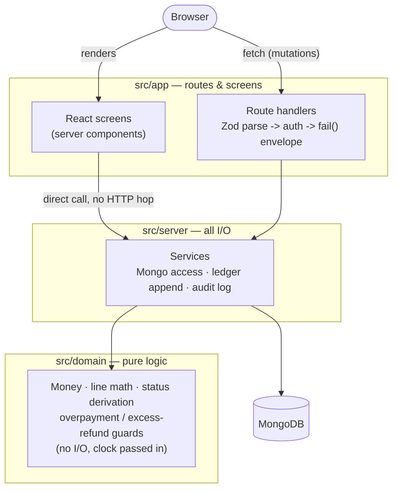
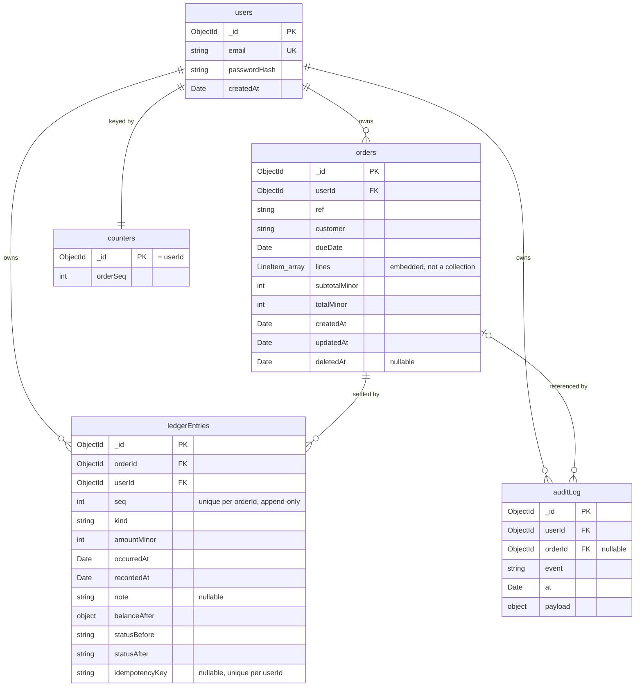

# Orders & Settlements

Tracks customer orders and the payments and refunds recorded against them, deriving
each order's status from its ledger rather than storing it. Built as a take-home:
Next.js (App Router) and TypeScript on top of MongoDB, no ORM.

**Live:** https://orders-and-settlements-ivory.vercel.app
**Demo login:** `demo@example.com` / `demo-password-123` (created by `npm run seed`)

## Architecture

Three layers, dependencies pointing inward only — `app` calls `server`, `server`
calls `domain`, and nothing calls back out. `src/domain` is pure TypeScript (no
I/O, no framework; the clock arrives as a parameter, and an ESLint rule enforces
the purity). `src/server` owns every MongoDB access, the ledger append protocol,
and the audit log, and makes no decision `domain` hasn't already made. `src/app`
is route handlers and React screens — parse, authorise, delegate, render.



Screens call the service layer directly — `page.tsx` imports from `src/server`
the same way a route handler does — rather than fetching the app's own REST
API. The API exists for the browser's own `fetch` calls (forms, CSV export),
not as an indirection layer between a server component and its data.

## Running it locally

Prerequisites: Node 20+, and a MongoDB cluster — a free Atlas cluster, a local
replica set, or a plain standalone `mongod` (nothing here uses transactions —
see Concurrency below).

```bash
cp .env.example .env.local
```

`.env.local` needs three variables:

| Variable | Meaning |
|---|---|
| `MONGODB_URI` | Connection string for a `readWrite` user scoped to one database. |
| `MONGODB_DB` | Database name (`orders_settlements` in the example). |
| `AUTH_SECRET` | Session-signing secret for Auth.js. Generate one with `openssl rand -base64 32`; do not reuse the placeholder. |

Then:

```bash
npm install
npm run seed   # creates demo@example.com and a handful of orders in various states
npm run dev    # http://localhost:3000
npm test       # pure domain logic + integration tests against a real in-memory
               # MongoDB (mongodb-memory-server). One file mocks the driver on
               # purpose — see the Concurrency section.
```

## API overview

Every route requires a session cookie except `POST /api/auth/register`. All request
and response bodies are JSON; money fields are integer minor units (see below).

| Method | Path | Purpose |
|---|---|---|
| `POST` | `/api/auth/register` | Create an account (email + password). |
| `GET` | `/api/orders` | List the caller's orders. Query: `status`, `page`, `pageSize`. |
| `POST` | `/api/orders` | Create an order (`customer`, `dueDate`, `lines[]`). |
| `GET` | `/api/orders/[id]` | One order plus its ledger entries. |
| `PATCH` | `/api/orders/[id]` | Update `customer` / `dueDate`. Rejected once any settlement exists. |
| `DELETE` | `/api/orders/[id]` | Soft-delete. Rejected once any settlement exists. |
| `POST` | `/api/orders/[id]/payments` | Record a payment. Honours `Idempotency-Key`. |
| `POST` | `/api/orders/[id]/refunds` | Record a refund. Honours `Idempotency-Key`. |
| `GET` | `/api/orders/[id]/audit` | Merged ledger + audit-log timeline for one order. |
| `GET` | `/api/orders/export` | CSV of orders matching `status`/`from`/`to`. |

Errors share one envelope:

```json
{ "error": { "code": "OVERPAYMENT", "message": "...", "details": { "maxAllowedMinor": 60000 } } }
```

| Code | HTTP | Meaning |
|---|---|---|
| `VALIDATION_ERROR` | 400 | Malformed input; `details.fields` maps field path → message. |
| `UNAUTHENTICATED` | 401 | No session. |
| `NOT_FOUND` | 404 | Missing, or owned by another user — the two are indistinguishable on purpose. |
| `ORDER_LOCKED` | 409 | Order has settlements; metadata can no longer change. |
| `OVERPAYMENT` | 409 | Payment would exceed the order total. `details.maxAllowedMinor` names the ceiling. |
| `EXCESS_REFUND` | 409 | Refund would exceed what has actually been paid. |
| `CONCURRENT_UPDATE` | 409 | Lost every retry against a racing writer; safe to resubmit. |
| `IDEMPOTENCY_KEY_REUSED` | 409 | The key was already used for a different order, kind, or amount. |
| `INTERNAL_ERROR` | 500 | Anything unexpected; logged server-side, not detailed to the client. |

## Money representation

Every amount is an integer count of minor units (cents) — `totalMinor`,
`paidMinor`, `amountMinor` carry the suffix everywhere they appear, in both the
domain types and the wire format, so a value is never ambiguous about its scale.
Conversion happens at exactly one boundary each way: `parseMinor` turns a
decimal string like `"1000.00"` into `100000` when a request arrives, and
`formatMinor` (via `formatMoney`) turns it back into a display string in the
UI. The CSV export deliberately skips that step — it's a machine-readable
file, not a screen, so its `totalMinor`/`paidMinor` columns carry the raw
integer; `csvCell` in `src/server/dashboard.ts` does no more than `String(value)`.

The reason is `0.1 + 0.2 !== 0.3`: IEEE-754 floats cannot represent most decimal
fractions exactly, and summing amounts as floats accumulates that error
silently — it doesn't announce itself on round numbers, right up until it
doesn't on some other input, and by then the ledger has committed a value off
by a fraction of a cent in a comparison meant to be exact
(`amountMinor > ceiling` in `src/domain/ledger.ts`). Integers under addition
and comparison have no such failure mode, so the domain layer never touches a float.

## Status derivation

`OrderStatus` is never stored. It's computed on every read from `totalMinor`, the
ledger's current balance, and the current clock, in `deriveStatus` (`src/domain/status.ts`):

1. `netPaid >= totalMinor` → `paid`
2. else `now > endOfDayUtc(dueDate)` → `overdue`
3. else `netPaid > 0` → `partially_paid`
4. else → `pending`

Storing status was rejected outright: `overdue` is a function of `now`, not of any
write that happened to the order, so a stored value would need updating by
something running on a schedule just to stay honest — and would already be wrong
the instant it did. Deriving it means the same order can report `overdue` on one
request and, after nothing more happens than the clock moving, still be correctly
`overdue` on the next, with no batch job in between. It also settles the brief's
own edge case directly: an order that goes overdue and is then paid in full reports
`paid`, because rule 1 is checked first — status is a priority list, not a
timeline. Refunds fall out of the same rule set for free: a refund lowers `netPaid`,
which can move an order backward from `paid` to `partially_paid`, so status is not
monotonic over an order's life and nothing in the code assumes it is.

Due dates are inclusive through end of day UTC — `endOfDayUtc` (same file) rounds a
due date up to `23:59:59.999` UTC before comparing against `now`, so an order due
"today" is not overdue until tomorrow, uniformly, regardless of which timezone the
due date was entered in. The UI's relative-due caption ("due in 3 days" / "3 days
overdue") is computed from that same boundary with `Math.floor` — not `Math.ceil`,
which was tried first and overcounted by a day, because a due date at
`23:59:59.999` makes a nominal 7-day gap measure `7.99999` days — so the caption and
the status badge can never disagree about which side of the line an order is on.

## Concurrency

**The invariant: payments may never exceed the order total, and it must hold under
concurrent requests.**

Read-then-validate-then-write is the obvious first attempt and it fails: two
requests both read a balance of $0 against a $1,000 total, both validate a $700
payment as within the ceiling, and both write — $1,400 recorded against $1,000
owed.

The next instinct is to wrap the read and the write in a transaction, and that
**also fails**, for a reason that's easy to miss. MongoDB's transactions give
snapshot isolation, which prevents write-write conflicts on the *same* document —
two transactions racing to update one order would correctly serialize. But the two
payments above don't update the same document; each *inserts a new ledger entry*.
Snapshot isolation has nothing to say about two transactions that read identical
state and each insert a *different* document — that's write skew, it is explicitly
permitted, and both transactions commit cleanly. A transaction here would pass
every test that doesn't specifically try to break it, and still let $1,400 through
on $1,000 owed.

The fix is to force the two writers through one shared conflict point instead of
trusting them to agree on one. Every ledger entry carries a per-order `seq`
(1, 2, 3, ...) under a unique index, `order_seq_unique` on `{orderId, seq}`. Two
concurrent appends against the same order both compute `seq = N` from the same
last-seen entry; one insert succeeds, the other raises a duplicate-key error. The
loser doesn't retry blindly — it re-reads the balance (now larger, because the
winner's payment is in it), re-validates the new request against the new ceiling,
and either succeeds at `seq = N+1` or is correctly rejected as an overpayment. See
`appendEntry` in `src/server/settlements.ts`.

Because every state change — a payment, a refund, a rejection's audit trail — is a
single-document insert, **the application uses no transactions anywhere**. That's a
stronger answer than reaching for a transaction would have been: a transaction here
would have been actively wrong (it doesn't close the write-skew hole), and the
unique-index approach is cheaper — one indexed insert plus, on collision, one
re-read — with no session, no two-phase commit overhead, and no cross-shard
transaction limitations to worry about if this ever needed to shard by order.

**On the evidence** — this claim survived a review that found the first version of
its own proof wasn't proving what it claimed to prove, which is worth stating
precisely rather than just asserting "there are tests":

- `tests/integration/settlements.test.ts`, `"lets exactly one of two racing payments
  through when only one fits"`, is the headline test — two payments fired
  concurrently at an order where only one can fit. It initially passed even against
  a build with the retry loop deleted, because it was the first concurrent burst in
  the file: both calls queued on a single lazily-opened connection in a cold pool
  and never actually overlapped in time. The harness now warms the pool before this
  test runs, which turns it into a real race — it fails 10/10 against the broken
  build and passes cleanly against the correct one.
- The test that specifically proves `order_seq_unique` is the conflict point is
  `"lets both through and orders them when both fit"`. With that index made
  non-unique, this is the test that fails — not the mocked retry tests, not the
  ten-way burst test with bounds-only assertions. If a reviewer wants the single
  strongest piece of evidence that the index is load-bearing, this is it.
- `tests/integration/settlements-retry.test.ts` mocks the collision and proves the
  retry *handler* — that a `seq` collision re-reads and retries, that an
  idempotency-key collision returns the original entry instead of retrying, that
  the loop gives up after `MAX_ATTEMPTS` — deterministically, without depending on
  real timing. It does not, on its own, prove the index causes real collisions
  under real concurrency; the two tests above do that.
- `tests/integration/refunds.test.ts` carries the same pattern one level further:
  the brief's own suggested race ("two concurrent full refunds") doesn't actually
  discriminate a working retry from a broken one, because at most one full refund
  can ever succeed regardless of whether the loser retries or just dies on its
  first collision. The real test there is three concurrent *partial* refunds where
  exactly two fit — that fails under a broken retry and passes under a correct one.

## Idempotency

Both settlement endpoints accept an `Idempotency-Key` header, enforced by a
partial unique index (`user_idem_unique` on `{userId, idempotencyKey}`, scoped
**per user** rather than per order — a key names "this specific request I
already told you about," not the order it targeted — and partial, so the many
requests that send no key at all — `idempotencyKey: null` — never collide with
each other). A request seen twice under the same key inserts no second ledger
entry; it returns the entry from the first call, with `replayed: true`.

A `seq` collision and a key collision are opposite branches of the same catch
block in `appendEntry`: a `seq` collision means someone else won a race you
were both trying to win, so the fix is to retry with fresh data; a key
collision means this exact request was already handled, so the fix is the
opposite of a retry — return what was recorded and insert nothing new.
Conflating them would double-process a legitimate retry, or infinite-loop on a
key that will never stop colliding.

One edge found in review: a key's scope is `{userId, idempotencyKey}` only, not
order/kind/amount, so a found row isn't automatically a replay of *this*
request — replaying a key previously used against a *different* order silently
returned that order's entry instead. `IDEMPOTENCY_KEY_REUSED` closes it: the
existing row's `orderId`, `kind`, and `amountMinor` are compared against the
incoming request, and any mismatch is refused with 409 rather than served.

The UI mints a fresh key per form submission, not once per dialog open. That
covers a request resent at the transport level (a proxy retrying an in-flight
fetch) but not a manual retry after a visible failure, which is left to the
submit button's disabled/busy state instead — a key stable per dialog open
would close that gap too, but would then collide with `IDEMPOTENCY_KEY_REUSED`
the moment a user edits the amount and resubmits, a worse failure mode than the
one it would fix. See the comment above the fetch call in
`src/app/(app)/orders/[id]/settlement-actions.tsx`.

## Data model and indexing

Five collections. No ORM — the MongoDB driver directly, with document types
(`UserDoc`, `OrderDoc`, `LedgerEntryDoc`, `AuditDoc`, `CounterDoc`) in
`src/server/db.ts`, which is also the source of truth for the fields below.



Three things that don't show up as boxes and arrows: **`lines` is an embedded
array field on `orders`**, not a collection — it has no independent identity,
is never queried, paged, or referenced on its own, and is always read with its
parent order. **There is no `status` field anywhere** — see Status derivation
above; storing one would need a scheduled job just to stay honest about
`overdue`. And **`ledgerEntries` is append-only** (`insertOne`, never updated
or deleted) — its running balance lives on the newest entry (`balanceAfter`),
so "current balance" is one indexed seek, not a sum, and the unique index on
`{orderId, seq}` is the concurrency guard the Concurrency section depends on,
not merely a sort key.

`counters` holds one document per user with the next order-reference number;
`$inc` on it is atomic, the same reasoning as the ledger's `seq`.

| Index | Collection | Serves |
|---|---|---|
| `email_unique` | `users` | Enforces one account per email. |
| `user_created` | `orders` | `{userId, createdAt: -1}` — the default dashboard sort. |
| `user_due` | `orders` | `{userId, dueDate: 1}` — due-date range queries (export, overdue sorting). |
| `order_seq_unique` | `ledgerEntries` | `{orderId, seq: -1}`, unique. Two jobs: the uniqueness constraint *is* the concurrency guard (above), and the same compound key serves the "latest entry for this order" lookup that every read needs. |
| `user_idem_unique` | `ledgerEntries` | `{userId, idempotencyKey}`, unique, partial. The idempotency guard above. |
| `user_order_at` | `auditLog` | `{userId, orderId, at: -1}` — the per-order audit timeline. |

## Editability and deletion

An order can be edited (`customer`, `dueDate`) freely — until the first
settlement is recorded against it, at which point it freezes entirely, metadata
included, not just line items. The reason is the same invariant as the
concurrency section: overpayment is validated against `totalMinor`, so if the
total could still move after money had been accepted, every prior acceptance
would be retroactively invalid. Freezing the whole order is the only way to
keep "this payment was valid when accepted" true forever — a deliberate
departure from the supplied mockup, whose locked-banner copy describes only
line items as locked; the banner text was reworded to match the actual rule.

Deletion is soft (`deletedAt`), and the reason isn't the usual "keep history for
undo" one. The natural hard-delete check — count the ledger entries, delete if
none — reads `ledgerEntries` and writes `orders`, two different documents, so a
payment landing between the read and the write conflicts with nothing: the
count reads zero, the delete proceeds, and the payment accepted a moment later
points at an order that no longer exists. A transaction doesn't close this, the
same write-skew reason one doesn't fix the payment race. Soft deletion doesn't
close the race either; it makes it benign — the worst case is an order flagged
`deletedAt` that still has one payment attached, recoverable.

## Status filtering and scale

The four status rules are encoded twice: once in TypeScript (`deriveStatus`,
every single-order read) and once as a MongoDB `$switch` (`statusExpression` in
`src/server/dashboard.ts`, used by the list, summary bar, and CSV export). That's
verbatim duplication of a logic block, which a review checklist would normally
flag on sight — deliberate, because the alternative isn't simpler, it's wrong.
Filtering after paging returns the wrong page (an `overdue` filter on page 2 of
unfiltered results isn't page 2 of overdue orders); filtering before paging
means loading every order just to throw most away. Encoding the rule in
`$switch` lets MongoDB filter and paginate correctly at the same time.

The risk duplication creates — the two encodings drifting apart silently — is
what `tests/integration/dashboard.test.ts` exists to catch: it runs a fixture
matrix through both `deriveStatus` and a live aggregation against
`statusExpression` and asserts they agree on every row. It was mutation-tested
against three independent ways the `$switch` could go subtly wrong (branch-order
swap, `$gt` vs `$gte` on the day comparison, status filter in the wrong pipeline
stage) and caught all three.

The `$lookup` that fetches each order's latest ledger entry is one indexed seek
per order via `order_seq_unique` — fine for a dashboard page, well past what a
single user would accumulate by hand. The read-model projection named under
"What I deliberately did not build" is the next step, once that join shows up
in profiling rather than in theory.

## Following the design

The UI is built from the supplied design mockup — its color and spacing tokens
and Tailwind configuration are used verbatim in `src/app/globals.css`, and
screen layout follows it closely enough that no screen invents a control the
mockup doesn't already use somewhere else (segmented control, card, pill).

Deliberate departures: **the locked banner's copy** (the mockup describes
only line items as locked; the actual rule locks the whole order, so the banner
was reworded to say that, keeping the same icon and placement); **refunds get
their own secondary action and dialog** (the mockup only covers payments — the
refund dialog reuses the payment dialog's field layout and inline-error
convention so it reads as one system); and **two mockup elements are omitted
outright** — the "Design tokens" handoff screen, not a product screen a user
would reach, and the "Send reminder" button, which has no backing feature.

**A top header replaces the sidebar**, brand mark on the left and the signed-in
email plus sign-out on the right. The mockup's persistent 216px nav rail earns
its keep across a larger app; four screens (dashboard, order detail, new order,
login) don't need a permanent rail, and the detail/new screens already carry
their own back link.

**The login page is a left/right split** — a dark brand panel with a product
screenshot on the left, the form on the right — replacing the mockup's centred
card, to give the login screen the same sense of product identity the rest of
the app gets from its header.

**The dashboard uses the mockup's `cards` summary variant and `comfortable`
row density.** The mockup draws both as alternatives to the inline-strip
summary and default row height used earlier in the build; this is a variant
switch within what the mockup already specifies, not a new design.

The subtotal caption on the create-order screen that explained "calculated in
the browser, the server recalculates on save" was removed — an implementation
detail the mockup doesn't show and a user doesn't need; the recalculation
itself is unchanged (see Money representation, above).

Separately, the sign-up form captures a full-name field but never sends it —
only email and password reach `/api/auth/register`, matching the brief. The
field stays because the mockup has it and removing it would be a visible design
change for no functional reason; it simply has no column to land in.

## Assumptions and tradeoffs

**Single currency, and `totalMinor === subtotalMinor`.** No per-order currency
field and no tax/discount line — `computeTotals` keeps `totalMinor` distinct
from `subtotalMinor` as a placeholder for a future tax/discount step, but
nothing populates it differently yet. Multi-currency is a non-goal, below.

**`bcryptjs` over argon2(id).** argon2 is the stronger algorithm by current
guidance, but its reference implementations ship as native bindings — the single
most common way a Node app builds on a laptop and fails on Vercel's build image.
`bcryptjs` is pure JavaScript and slower per hash; for a take-home whose entire
user base is one reviewer's browser, that's the right tradeoff, and one to
revisit before this handled real signup volume.

**Passwords are bounded at 72 bytes, not characters.** bcrypt silently
truncates at 72 bytes, so two long passwords sharing the first 72 would
otherwise hash identically and authenticate the same account — a real, silent
bug. Registration rejects a password whose `TextEncoder`-encoded byte length
exceeds 72; bytes, not characters, because multibyte characters can exceed 72
bytes well before 72 characters.

**Order references come from a per-user counter, not a UUID or timestamp.**
`$inc` on a single `counters` document is atomic, so two orders created in the
same millisecond still get distinct, sequential references (`ORD-1001`,
`ORD-1002`) — the same atomic-write pattern used everywhere else here.

**Atlas network access is open (`0.0.0.0/0`) rather than IP-restricted**,
because Vercel's functions egress from a dynamic range an allowlist can't pin
down. Still authenticated (a scoped `readWrite` user) and encrypted in
transit; the production-correct answer is an Atlas Private Endpoint or VPC
peering, named rather than left for a reviewer to wonder about.

## What I deliberately did not build

**Read-model projections.** The dashboard joins `orders` to each order's latest
`ledgerEntries` row per request — the right amount of engineering for the data
volume a take-home reviewer will generate. **Trigger:** order counts reaching
the low thousands, where the join shows up in profiling, not in theory.

**Multi-currency.** Every amount is an integer in one implicit currency, with
no currency field anywhere. Supporting more isn't a formatting change — it
changes what "the order total" means, which changes the ceiling comparison at
the center of the concurrency section. **Trigger:** a real second currency
needed for a real customer, because the change touches the domain layer's
core invariant, not just the UI.

**A void/reissue flow.** Refunds handle "money should come back"; nothing
handles "this order should never have existed" as a distinct action — today
that's a soft-delete or a refund to zero. **Trigger:** reporting needing to
distinguish "paid and refunded in full" from "a mistake that never should
have been billed" — those tell different stories even at the same balance.

**Rate limiting on auth.** Registration and sign-in have no throttling beyond
bcrypt's own cost factor. Acceptable for a take-home behind a URL nobody is
scanning. **Trigger:** a public, discoverable URL with real accounts behind
it — a per-IP-and-per-account limiter in front of both routes.

**HTTP-level tests for the route handlers.** Every handler under `src/app/api`
is thin — authorise, parse, delegate to a `src/server/*` function, translate
through `ok()`/`fail()` — and is covered at the schema and service layers,
against a real in-memory MongoDB, rather than again over an actual HTTP
request. **Trigger:** a handler ever growing logic beyond that shape; until
then, route-level tests would just re-test the layer below.

## What I'd improve before production

Every shortcut below is deliberate and grep-able (`grep -rn "ponytail:" src/
scripts/`); each is a documented ceiling, not a silent gap.

- **`src/server/settlements.ts`** — the retry loop in `appendEntry` uses a fixed
  bound (`MAX_ATTEMPTS = 5`) with no backoff, fine because contention here is two
  browser tabs, not a thundering herd. **Trigger:** real concurrent load, like a
  payment processor's webhook retries. **Upgrade:** jitter or exponential backoff.
- **`src/server/orders.ts`** — the audit row alongside `order.created` is
  best-effort: a failure is logged, not surfaced or retried. **Trigger:** audit
  completeness becomes a hard compliance requirement. **Upgrade:** an outbox row
  written in the same insert, drained by a separate worker — not a transaction,
  which wouldn't survive the append-only ledger model.
- **`src/server/dashboard.ts`** (latest-balance lookup) — one indexed `$lookup`
  seek per order per dashboard load, discussed under "Status filtering and
  scale." **Trigger/upgrade:** the same read-model projection named there.
- **`src/server/dashboard.ts`** (`exportOrders`) — the CSV export buffers every
  matching row in memory; no pagination or streaming. **Trigger:** an export
  large enough to make that a real memory concern. **Upgrade:** stream the
  aggregation cursor into the response instead of materializing an array first.
- **`src/app/(app)/orders/[id]/settlement-actions.tsx`** — the idempotency key is
  minted fresh per form submission, not per dialog open. Covered in full under
  "Idempotency" above; recorded here for completeness — it's closer to
  "correctly decided against" than "deferred," so there's no upgrade trigger.

Two smaller, verified-safe items worth naming rather than hiding: the CSV
export's formula-injection guard (a leading apostrophe before `=+-@`) is lossy
for a customer genuinely named `-Acme` outside a spreadsheet reader. And
re-running `npm run seed` clears `orders`/`counters` but leaves
`ledgerEntries`/`auditLog` behind — harmless, not tidy. Accepted trade-offs of
tools built for this project's actual scale, not defects in disguise.
